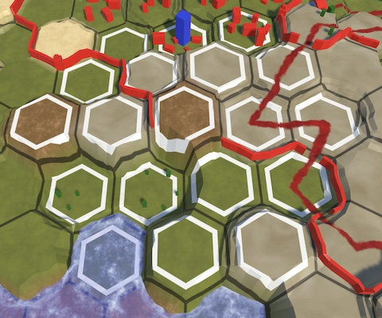

# Changes

As new versions get released the The Hex Map project will deviate more and more from the [Hex Map tutorial series](https://catlikecoding.com/unity/tutorials/hex-map/). Things get changed, stuff gets removed, and new features are added. This is a list of the high-level changes that are visible to the player. See the [CHANGELOG](../CHANGELOG.md") a more specific low-level list.

## [2.2.0] - Terrain Feature Visibility

Per-vertex visibility of terrain features has been improved. This is most obvious for walls, which cross cell boundaries. The old approach had artifacts where the wrong cell data was used.

 

## [2.2.0] - Grid Lines

Hex grid lines are now always sharp. This is most obvious on cliffs, where the old approach produced fuzzy lines.

 

## [2.2.0] - Cell Highlighting

While in edit mode, cells that will be affected by an edit action are now highlighted with white hexagons. It's draw the same as grid lines so is part of the terrain and thus hidden by everything drawn on top of it.

## [2.2.0] - Underwater Terrain Coloration

Underwater terrain is now colorized based on its submergence, shifting the color to blue the deeper it goes. This is relative to the cell's water level.

 
